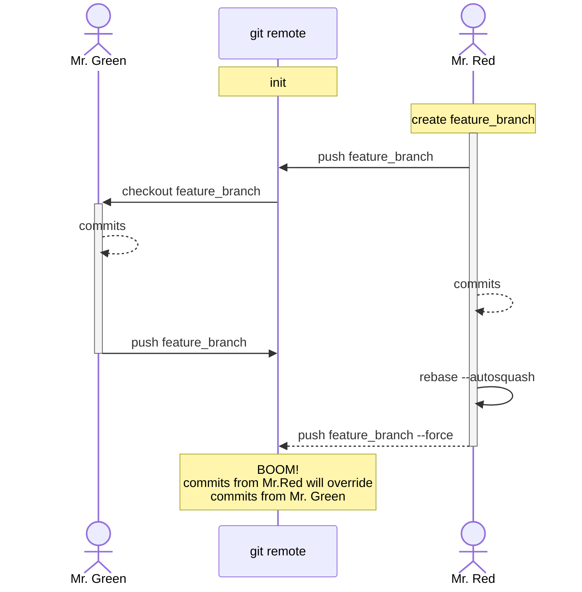

## Why do we need to force-push?

Force-pushing is not always a bad thing. Sometimes we actually want to re-write the git history.
This can be useful if:

- we want to update a [commit message](https://git-scm.com/docs/git-commit#Documentation/git-commit.txt---amend)
  of a previous commit (`git commit --amend`);
- we want to squash-merge dozens of small commits before presenting the code to the review (`git rebase autosquash -i`).
  When combined with [fixup commits](https://git-scm.com/docs/git-commit#Documentation/git-commit.txt---fixupamendrewordltcommitgt)
  this allows to group changes in well-described commits;
- we want to remove sensitive information (like leaked credential) from the repository;
- we rebase our branch (on top of the updated main for example);

In all these cases we actually want to re-write the git history, so we need to use _force_-push.

## A safer force-push

But `git push --force` is a dangerous, unconditional override of the history on remote.

In `git` we usually have a branch per feature. This branch is _usually_ maintained by a single developer
from the creation till merge, and _usually_ force-pushing to this branch is a relatively safe operation
with low risk of overriding someones work. Still sometimes other authors (developers or automation) may
push to your feature branch and we don't want to lose these changes.

To completely avoid the risk, we should use `git push --force-with-lease` instead of `git push --force`.
`--force-with-lease` will block the operation if the remote branch has changes that are not in your local copy.
[Official documentation](https://git-scm.com/docs/git-push#Documentation/git-push.txt---force-with-leaseltrefnamegt)
has a bit more detailed explanation, but in simple words:

> `--force-with-lease` will not allow you to override someones changes that were not pulled to your local copy.

**As a rule of thumb**: always use `--force-with-lease` unless you have very good reasons to use `--force`.

### Danger zone

If _after_ re-writing your local history, but _before_ pushing the changes to remote,
you _update_ your local remote-tracking branches (with `git fetch` for example), `--force-with-lease` will **not** save you
from overriding others changes. In this case `git` assumes that's your intention to override someones changes.

## Example



Let's simulate this scenario locally, I'll use [fixup commits](https://git-scm.com/docs/git-commit#Documentation/git-commit.txt---fixupamendrewordltcommitgt) as example.
`git` can use a local repository as remote (I'll use _bare_ repository for this).
We're interested in commits, not the actual changes, so all commits will be empty
(done with `--allow-empty` [flag](https://git-scm.com/docs/git-commit#Documentation/git-commit.txt---allow-empty)).

### Initial setup

First, let's create a _remote_ (a [_bare_](https://git-scm.com/docs/git-init#Documentation/git-init.txt-code--barecode) git repository):

```console
$ mkdir remote
$ cd remote
remote $ git init --bare
```

Mr.Green clones the repository, configures the user,
initializes the `main` branch with an empty commit and pushes it to the remote:

```console
$ mkdir green
$ git clone remote green
$ cd green

green $ git config --local user.name "Alex Green"
green $ git config --local user.email "alex.green@address.com"

green $ git commit -m "initial commit" --allow-empty
green $ git push origin main
```

Next, his co-worker, Mr.Red clones the repository and configures his user:

```console
$ mkdir red
$ git clone remote red
$ cd red

red $ git config --local user.name "Bob Red"
red $ git config --local user.email "bob.red@address.com"
```

Now we have 2 clones from different people of the same remote.

### Creating a conflict

Mr.Red creates a branch, makes a few changes and pushes the branch to the remote:

```console
red $ git checkout -b feature_branch
red $ git commit -m "change from Red 1" --allow-empty
red $ git commit --fixup HEAD --allow-empty
red $ git push --set-upstream origin feature_branch
```

Mr.Red invites his co-worker - Mr.Green - to help. Mr.Green checks out `feature_branch`,
makes some changes and pushes the branch back to remote:

```console
green $ git pull
green $ git checkout feature_branch
green $ git commit -m "change from Green 1" --allow-empty
green $ git push origin feature_branch
```

In the meanwhile, Mr.Red continues to make changes. When ready, he squashes the changes
to produce a "clean" history for the review process:

```console
red $ git commit --fixup HEAD~1 --allow-empty
red $ git rebase --autosquash --interactive HEAD~3  # accept all changes
```

Boom! Now the git history in Mr.Reds local copy has a conflict with the remote (what Mr.Green pushed):

```console
red $ git log --oneline feature_branch
266b934 (HEAD -> feature_branch) change from Red 1
71737b9 (origin/main, origin/HEAD, main) initial commit

green $ git log --oneline feature_branch
fa25da6 (HEAD -> feature_branch, origin/feature_branch) change from Green 1
c905bcf fixup! change from Red 1
863c570 change from Red 1
71737b9 (origin/main, main) initial commit
```

(note the commit hashes!)

### Handling the conflict

Mr.Red re-wrote the history of his branch, and if he tries to `git push`, the operation will fail.
Mr.Red knows that he needs to _force_-push in order to send his branch to the remote.

Mr.Red might not be aware of the changes from Mr.Green, so using `git push --force` will _override_ the commit from Mr.Green.
`--force-with-lease` prevents it:

```console
red $ git push origin feature_branch --force-with-lease
To C:/Projects/git_push_force_example/remote
 ! [rejected]        feature_branch -> feature_branch (stale info)
error: failed to push some refs to 'C:/Projects/git_push_force_example/remote'
```

Voila! Mr.Red didn't override someones commit and needs to rebase and re-apply his changes.

### Danger zone

If Mr.Red _updates_ his local remote-tracking branches (with `git fetch`):

```console
red $ git log --oneline origin/feature_branch
c905bcf (origin/feature_branch) fixup! change from Red 1
863c570 change from Red 1
71737b9 (origin/main, origin/HEAD, main) initial commit

red $ git fetch
red $ git log --oneline origin/feature_branch
fa25da6 (origin/feature_branch) change from Green 1
c905bcf fixup! change from Red 1
863c570 change from Red 1
71737b9 (origin/main, origin/HEAD, main) initial commit
```

the push operation _will succeed_ and it _will override_ the commit from Mr.Green on the remote.
This happens, because `git fetch` brings the commit from Mr.Green to the local copy of Mr.Red,
and `git` assumes that Mr.Red actually wants to override the commit from Mr.Green.

## Conclusion

Always prefer `git push --force-with-lease` over `git push --force` and use `git fetch` consciously.
